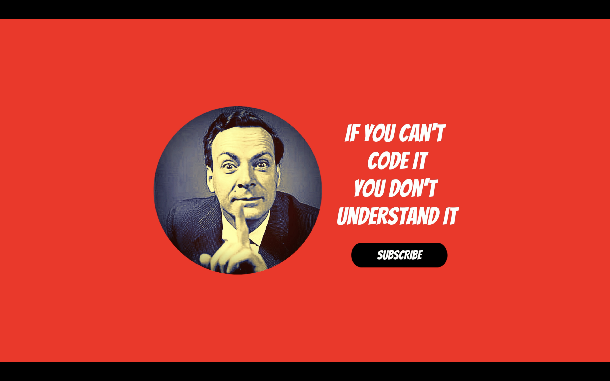

   

---

Hey there, thanks for checking this repo, here you cand find all the code used in the videos
from the [BWD channel](https://youtube.com/@Buildwd) which do not have their own repo

BWD was born out of the need of:

- sharing my passion for coding and help others to learn
- engage with other people to learn from them and their experience

So if you have any question or you see a bug, do not hesistate to comment on the related video or
open an issue or a pull request here, **don't be shy !!!**

And of course if you like this content, please give a ⭐ here and subscribe to the [channel](https://youtube.com/@Buildwd),
that really helps a ton and keeps me going !!!

## That said, how to navigate this ?

Here in each folder you will find all the code from either a single video or mutiple ones from
a short series. Each folder is named accordingly to the video, so for example all the code from
videos of the pytube series are found in the pytube folder.

still cannot find it !? just go back to the video and in the description section there is gonna be
for sure a link to the right folder
