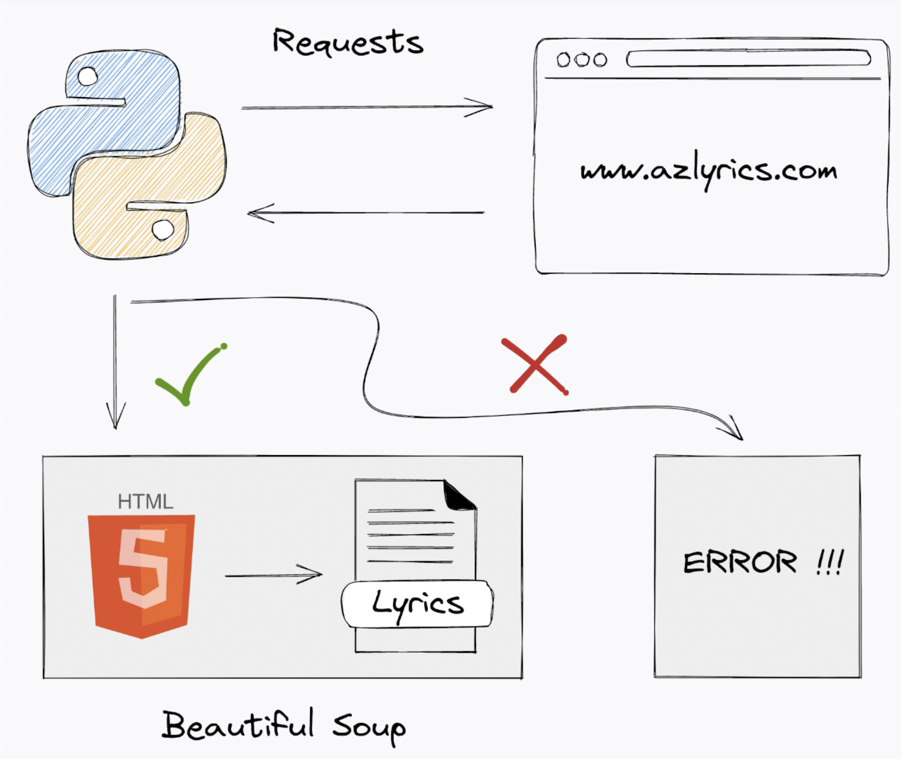

   

---

This project teaches you how to build a command line app to scrape song lyrics from the internet

By the end of this series you will be able to run it like this:

    mylyrics --artist beatles --song yesterday

Code from each episode is available in the folder `./episodeX` found here

Video playlist available [here](TODO)
