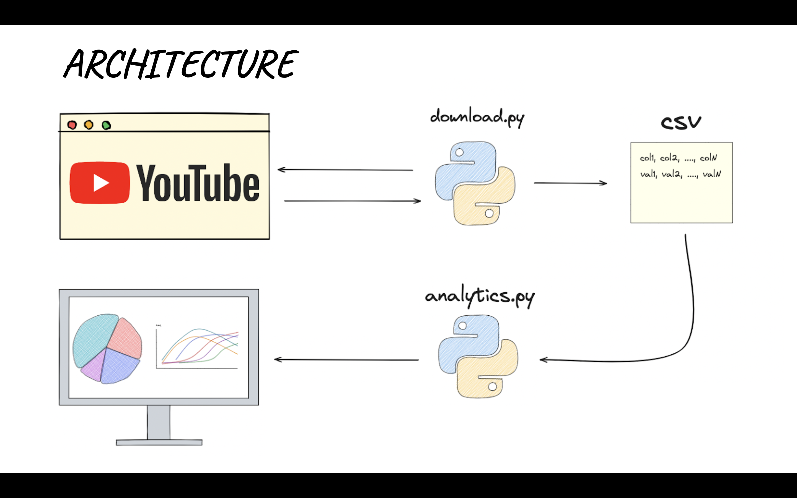

   

---

Code can be found at `./code`

Do not forget to install dependencies listed at `./requirements.txt`

Video playlist available [here](https://youtube.com/playlist?list=PLeOoFBQ0kLpM1GHm4qhxRPF4A8WdlTwsA)

Patches can be found at `./patch`... but why should you patch pytube !?

Pytube is having a few issues recently and I guess they are struggling to find maintainers.
Luckily the project is very popular and as soons as something breaks a patch is pushed.

In this video I explain how to patch the code, the only headache is that you have to look into the pull request
tab and find what is needed everytime something does not work.
To save you time in the `./patch` folder you will always
find an updated version of all the files that have been patched but not yet merged in the master branch
